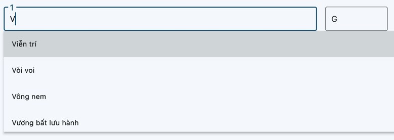

# med_form
 A pet project with medicine information input and a completed form output.

## What I used
- Dart/Flutter
- Package: screenshot, image_gallery_saver, permission_handler

## What this app can do
Take patient information as input data and then render a medicine form (image saved to gallery).

Function:
- Auto Complete for Medicine Name:

